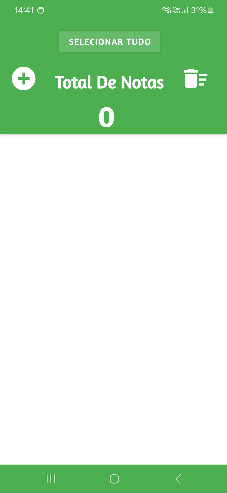
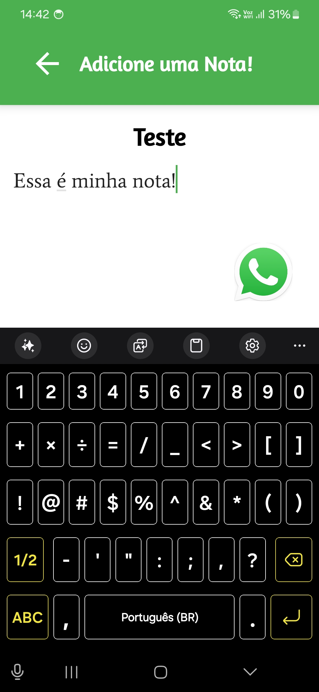
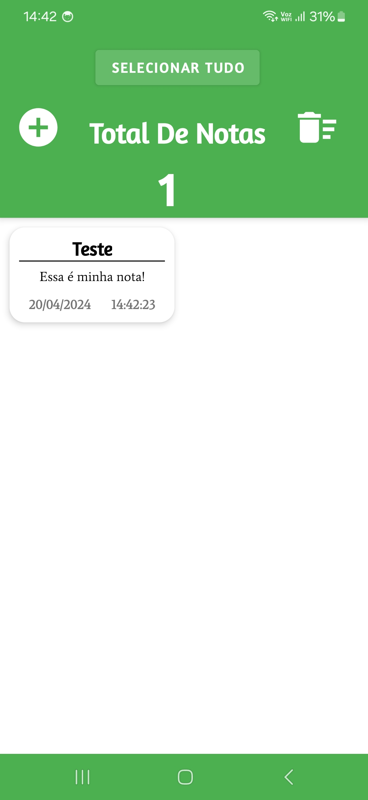

# Guia de Uso do Aplicativo de Notas

## Introdução

Este documento serve como um guia para o uso eficiente do **Aplicativo de Notas**. O aplicativo
permite criar, salvar e gerenciar suas notas de maneira simples e intuitiva.

## Criação de Notas

Para adicionar uma nova nota, siga os passos abaixo:

1. Pressione o botão com o símbolo “+” na tela principal.
2. 
2. Você será direcionado para a página de criação de nota.
3. 
3. Insira um título no campo `Insira o título aqui`.
4. Digite o conteúdo da nota no campo `Digite seu texto aqui`.
5. 
5. Ao retornar para a tela principal, a nota é salva automaticamente com a data e hora atual.
6. 

## Gerenciamento de Notas

### Atualização de Notas

- Ao atualizar uma nota existente, a data e hora originais da criação são mantidas, mesmo após a
  edição.

### Seleção de Notas

- Utilize o botão `SELECIONAR TUDO` para marcar ou desmarcar todas as notas da lista.

### Exclusão de Notas

- Notas marcadas podem ser excluídas pressionando o ícone da lixeira.
- Uma mensagem de confirmação será exibida. Selecione `SIM` para confirmar a exclusão ou `NÃO` para
  cancelar.

## Conclusão

Este aplicativo foi projetado para facilitar o gerenciamento de anotações diárias. Com uma interface
amigável e processos simples, suas informações ficam organizadas e acessíveis.

Para qualquer dúvida ou suporte adicional, entre em contato com o serviço de atendimento ao cliente.
