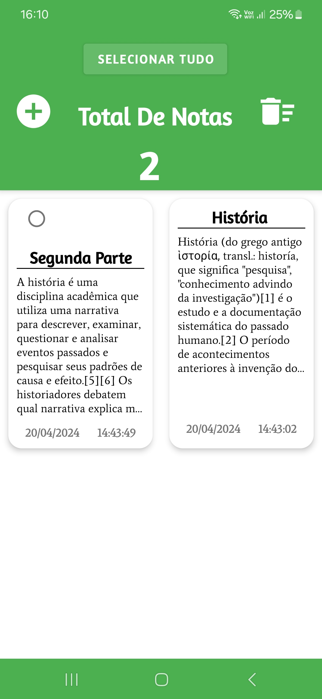

# Guia de Uso do Aplicativo de Notas

## Introdução

Este documento serve como um guia para o uso eficiente do Aplicativo de Notas. O aplicativo permite
criar, salvar e gerenciar suas notas de maneira simples e intuitiva.

## Criação de Notas

Para adicionar uma nova nota:

1. Pressione o botão com o símbolo “+” na tela principal.
2. 
2. Você será direcionado para a página de criação de nota.
3. 
3. Insira um título no campo “Insira o título aqui”.
4. Digite o conteúdo da nota no campo “Digite seu texto aqui”.
5. 
5. Ao voltar para a tela principal, a nota é automaticamente salva com a data e hora atual.
6. 

## Gerenciamento de Notas

### Atualização de Notas

- Ao atualizar uma nota existente, a data e hora originais da criação da nota são mantidas, mesmo
  após a edição.

### Seleção e Exclusão de Notas

#### Marcação de Notas

- Para selecionar notas individuais, clique e segure uma nota até que o checkbox apareça.
- 
- Marque o checkbox para selecionar a nota.
- 
- Utilize o botão “SELECIONAR TUDO” para marcar todas as notas.
- 
- Se todas as notas estiverem selecionadas, o mesmo botão servirá para desmarcar todas.
- 

#### Exclusão de Notas

- Somente as notas marcadas poderão ser excluídas.
- Pressione o ícone da lixeira para excluir as notas selecionadas.
- Uma mensagem de confirmação será exibida. Escolha `SIM` para confirmar a exclusão ou `NÃO` para
  cancelar.
- 

## Compartilhamento de Notas

### Enviar Notas por WhatsApp
- Você pode compartilhar o conteúdo de suas notas diretamente via WhatsApp.
- Para isso, selecione a nota desejada e utilize a opção de compartilhamento para enviar a descrição da nota para seus contatos no WhatsApp.
- 

Certifique-se de ter o aplicativo do WhatsApp instalado em seu dispositivo para utilizar essa funcionalidade.

## Contribuições
Seus comentários e contribuições são bem-vindos! Se você tem alguma sugestão para melhorar este aplicativo ou deseja reportar um bug, por favor, entre em contato através do e-mail newoverride@gmail.com.
Agradeço seu apoio para melhorar continuamente minha aplicação.

## Conclusão
Este aplicativo foi projetado para facilitar o gerenciamento das suas anotações diárias. Com uma
interface amigável e processos simples, você pode manter suas informações organizadas e acessíveis.